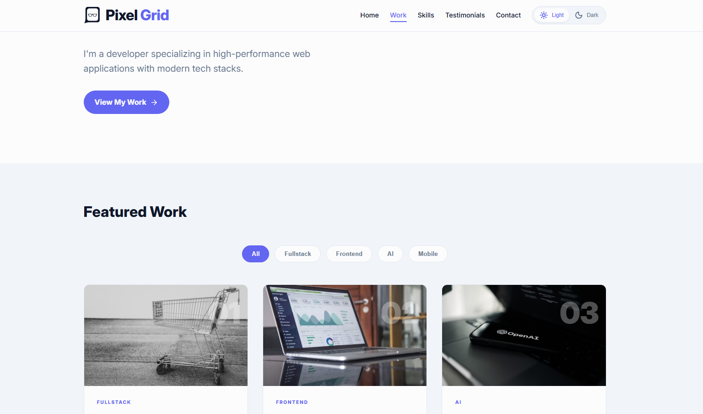

# 🎨 Pixel Grid | Modern Developer Showcase

https://pixel-gridx.netlify.app/

**Pixel Grid** is a modern coding exercise project that highlights frontend development skills and portfolio design, built with clean architecture and a minimalist UX approach.

## 👍 My Challenges

- Implemented a global `ThemeContext` using `React Context API` and `useMemo`.
- Synced theme state with `localStorage` and the `document.documentElement` class list via `useEffect`, enabling a smooth "Ghost White" ↔ "Deep Slate" transition.
- Designed a modern mobile menu for an improved user experience.
- Applied a minimalist slate palette, strong visual hierarchy, and subtle indigo accents for clean typography.
- This project strengthened my problem-solving skills and sharpened my attention to detail 💪.

## 🛠️ Build With:

- React JS
- Semantic HTML5 markup
- CSS Flexbox and Grid
- Mobile-first workflow
- Custom CSS properties
